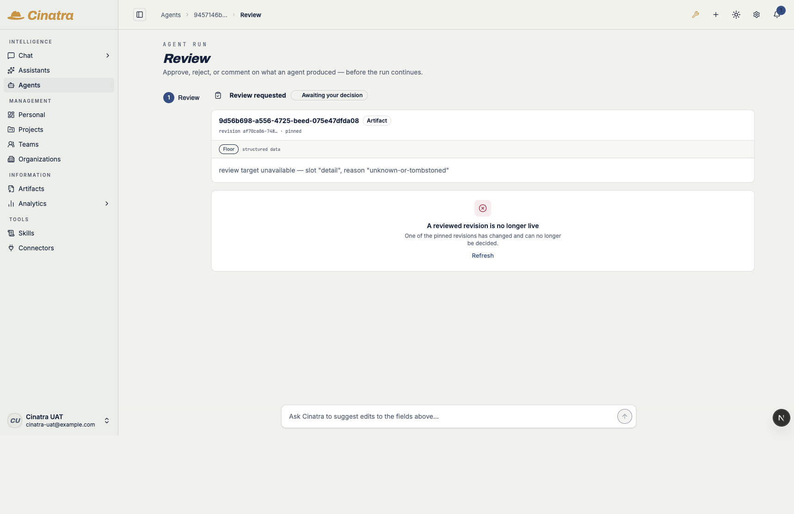
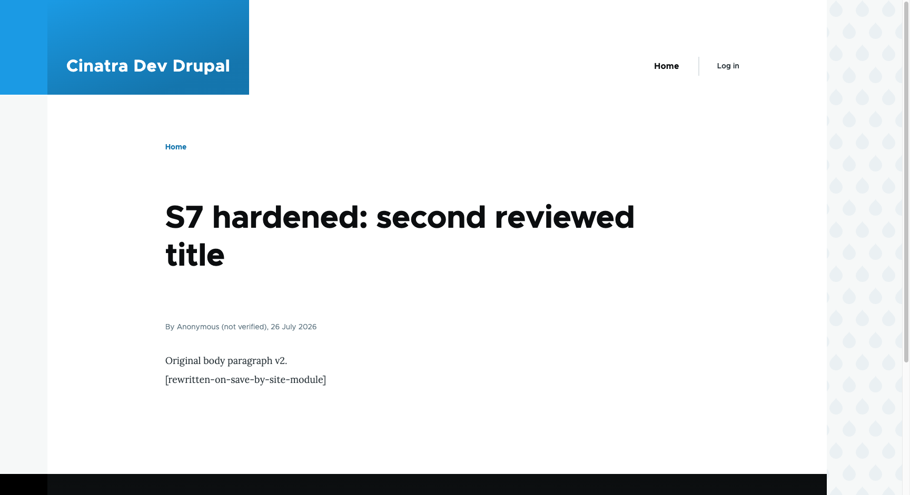
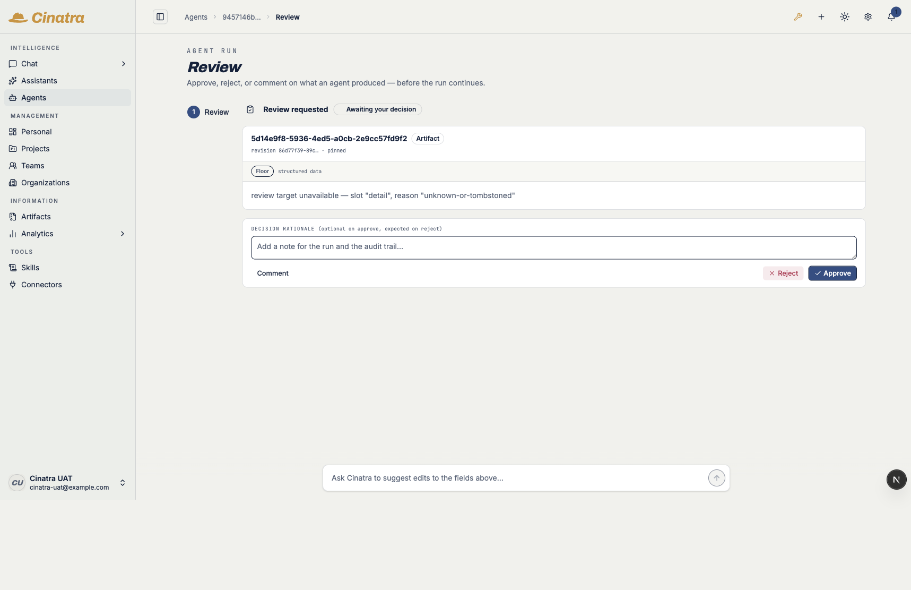

# cinatra#2045 S7 — Drupal staged-write review trigger: live end-to-end proof

The REAL trigger in this branch, driven through the REAL published host
`@cinatra-ai/host:cms-review` capability (`buildCmsReviewHostSeam` → the real core
`captureCmsContentSnapshot` / `resolveArtifactEffectDisposition` /
`recordCmsApplyVerification`, cinatra#2082 + #2084 on main), against a REAL
Postgres (`s72045` on `127.0.0.1:5634`) and a REAL Drupal 11 + `drupal/mcp_tools`
container (isolated compose project, port 8592). The review fence was ON
(`CINATRA_LIFECYCLE_REVIEW_ORCHESTRATION=on`). The Cinatra app ran on port 3083
against the same database, so the gates below were opened by the app's OWN
review-orchestration loop and rendered on its OWN run-embedded review surface.

Every stage below was re-run END-TO-END on the FINAL, codex-converged code (all
four hardening fixes in the PR ledger applied).

Machine-readable store state: [`store-proof.json`](./store-proof.json).

**Stand-ins (named honestly).** Outside the app there is no MCP request frame, so
the walk supplies the org / run / actor the frame would carry (`resolveIdentity`)
and resolves the per-user write-authority gate (proven separately by the
connector's own `write-authority` suite). Everything else — the trigger, the
capture transaction, the disposition, the Drupal MCP transport, the apply, the
read-back verdict — is the real code path. This mirrors the merged WordPress host
lane's harness exactly.

## D1 — staged Drupal write captured + HELD; Drupal unchanged

A staged `drupal_node_update` (propose `title`) through the trigger, fence ON:

- decision `status = "pending_review"`, `applied = false` — the effect is held;
  `mcp_update_content` is never called.
- ONE capture transaction wrote, in the same schema:
  - `objects` row `type = @cinatra-ai/objects:cms-content-snapshot` (the snapshot artifact, `run_id` = the producing run);
  - a `representation` revision 1 (the review/verification pin);
  - a `cms_snapshot_targets` apply binding — `operation_id` (bound to instance + bundle + node + EFFECT + authorized scope + the base CAS ref + the proposal), `scope_manifest = {paths:["title"]}`, `connector_instance`, `resource_type = article` (the Drupal BUNDLE), `resource_id` (the node id), `base_remote_revision_ref` (the CAS anchor over the current node);
  - an `artifact_produced_outbox` event — `emitter = object_cms_snapshot_capture`, `destination_class = external_publish`, `continuation_mode = async_effects_gated`.
- **Drupal unchanged while pending** — an independent drush read before and after
  the call returns the same `title`, `body`, `status` AND the same `changed`
  timestamp (no save occurred at all).

## D2 — the gate renders on the run-embedded review surface

`sweepReviewOrchestration` (the app's own loop) consumed the produced event and
opened a review gate PINNED to the snapshot revision, on the producing run. The
run-embedded surface renders it: "Review requested / Awaiting your decision", the
pinned target (artifact + `revision … · pinned`), and the Approve / Reject /
Comment decision bar.

**Floor state — and the grounded reason.** The target's CONTENT preview floors —
*"review target unavailable — slot "detail", reason "unknown-or-tombstoned"* — and
a UI decision is refused with *"A reviewed revision is no longer live"*.

D2 was re-run AFTER the CMS-snapshot renderer enrollment landed on cinatra main
(#2101, merged during this lane) with the renderer extension present in the dev
checkout — **it still floors**, and the reason is upstream of this connector:

> the core capture writer persists the snapshot resource's `mime` as the blob
> store's **DETECTED** type (`text/plain` for the JSON field serialization), not
> the **declared** `application/vnd.cinatra.cms-fields+json`. #2100's
> representation-dispatch fallback keys on `(orgId, mime)`, so it can never match
> the CMS-snapshot renderer. Verified on this stack: `resource.mime = text/plain`
> while `objects.data.mime = application/vnd.cinatra.cms-fields+json`.

That is a **core / #2044 rendering-side item affecting WordPress identically**
(same writer, same MIME path) — not a trigger gap. The approval below therefore
rides the store engine (`commitReviewDecision`), exactly as the merged WordPress
host lane's proof did.

## D3 — approve releases the effect → Drupal changes → read-back `verified`

- `commitReviewDecision(approve)` → `committed`; the gate is `resolved` /
  `disposition = approve` with its audit row.
- Re-drive of the trigger with the same proposal against the same base → the SAME
  `operation_id` (deterministic) → disposition `approved` → decision
  `action = "apply"`.
- The apply landed on Drupal: `mcp_update_content` returned `fields_updated:
  ["title"]` with a new node revision; the independent drush read shows the new title.
- The connector's INDEPENDENT post-apply re-read fed `recordApplyVerification` →
  **`verified`**, `artifact_verification_records.outcome = verified`, scope
  manifest `{paths:["title"]}`.

## D4 — out-of-scope rewrite on save → `drifted` + a reopened gate on the run

A lane-local Drupal module (`s72045_drift`, `hook_node_presave`) appends
`[rewritten-on-save-by-site-module]` to `body` on every save — the Drupal
analogue of the WordPress mu-plugin used in the S5 drift proof. A SECOND proposal
(title only, scope `{title}`) was captured, gated, approved, and applied:

- After the apply the independent re-read sees `body` rewritten OUT OF SCOPE.
- `recordApplyVerification` → **`drifted`**, `outOfScope = ["body"]`;
  `artifact_verification_records.outcome = drifted` with the `field_diff` showing
  the before/after body.
- The failed verification **reopened a bounded gate on the same run**
  (`lifecycle-review:verify:…`), pinned to the post-apply revision and rendered on
  the run-embedded surface — the rail entry.

